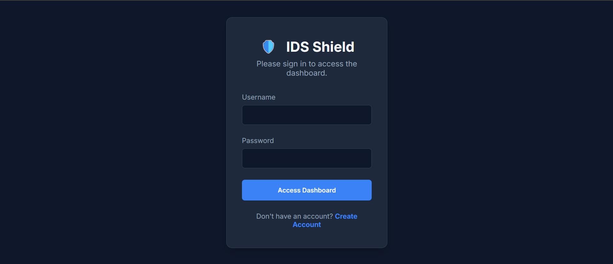
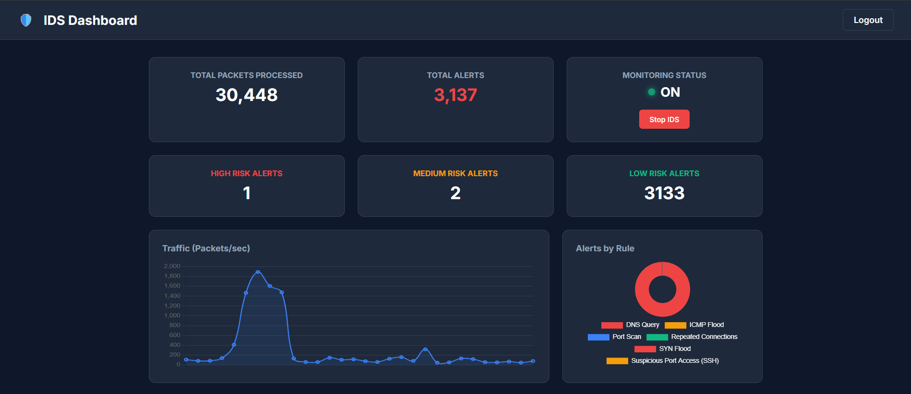

# 🔐 Web-Based Intrusion Detection System (IDS)

A real-time network monitoring and intrusion detection system built using Python, Flask, and Scapy. This tool provides an interactive dashboard for tracking network traffic, detecting security threats, and classifying risks.

---

## 🚀 Key Features

- Real-Time Packet Sniffing: Capture and analyze TCP, UDP, and ICMP packets  
- Threat Detection:
  - SYN Flood Detection  
  - ICMP Flood Detection  
  - Port Scan Detection  
  - Suspicious Port Monitoring (22, 23, 3389)  
- Risk Level Classification: Alerts categorized as HIGH, MEDIUM, LOW  
- IP Geolocation: Shows Country, City, and ISP  
- DNS Monitoring: Tracks visited domains (e.g., YouTube, Google)  
- Simulation Mode: Works without setup  
- Modern Dashboard: Live graphs, alerts, and analytics  

---

## 📸 Dashboard Preview

---

## 🛠️ Requirements

- Python 3.x  
- **Windows:** Npcap → https://npcap.com  
- Administrator / Sudo privileges  

---

## 📦 Installation & Setup

### 🪟 Windows Users

Step 1: Clone the Repository  
git clone https://github.com/Ayushraj06-prog/Intrusion-Detection-System.git  
cd Intrusion-Detection-System  

Step 2: Install Dependencies  
pip install -r requirements.txt  

Step 3: Run the Application  
⚠️ Run terminal as Administrator  
python app.py  

Step 4: Open in Browser  
http://localhost:5000  

---

### 🐧 Linux Users

Step 1: Clone the Repository  
git clone https://github.com/Ayushraj06-prog/Intrusion-Detection-System.git  
cd Intrusion-Detection-System  

Step 2: Install Dependencies  
pip3 install -r requirements.txt  

Step 3: Run the Application  
sudo python3 app.py  

Step 4: Open in Browser  
http://localhost:5000  

---

## 🔐 Default Login

Username: admin  
Password: admin123  

---

## 🛡️ Modes

Live Mode:  
Uses Npcap (Windows) or native Linux interfaces to capture real network traffic  

Simulation Mode:  
Runs without setup using generated traffic  

---

## ⚠️ Important Notes

- Run terminal as Administrator (Windows) or use sudo (Linux)  
- Npcap is required only on Windows  
- Automatically switches to simulation mode if permissions are not available  

---

## 🤝 Contributing

Feel free to contribute, report issues, or suggest improvements.

---

## 📄 License

MIT License
